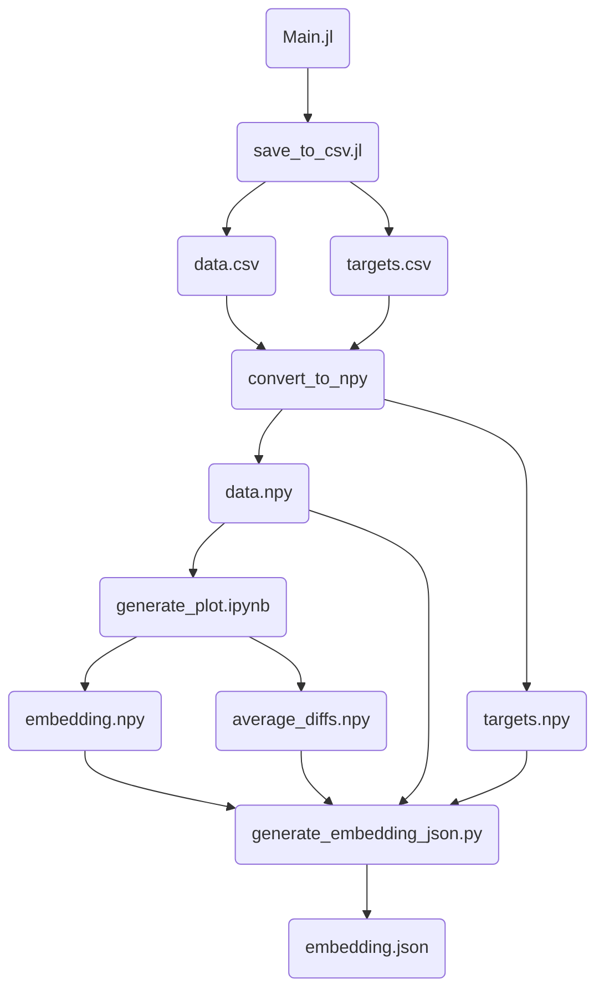

# Cellular Automata Classificiation using UMAP

## About

[Here](https://kylehovey.github.io/blog/automata-nebula) is my original post on the topic. I recently discovered that cellular automata are especially sensitive to initial conditions (which in hindsight should have been obvious). Because of this, classifying all of the Life-Like CA only using a 50% initial random distribution of living/dead cells missed some structure where critical behavior occurred outside of that distribution.

This version of the project runs multiple trials given different stochastic initial conditions, then re-runs UMAP clustering to see what structure emerges. The output of the data pipeline here is a JSON file that can be put into [the explorer](http://kylehovey.github.io/automata-nebula-explorer/index.html) if you clone the project and run it locally.

## Data Pipeline

