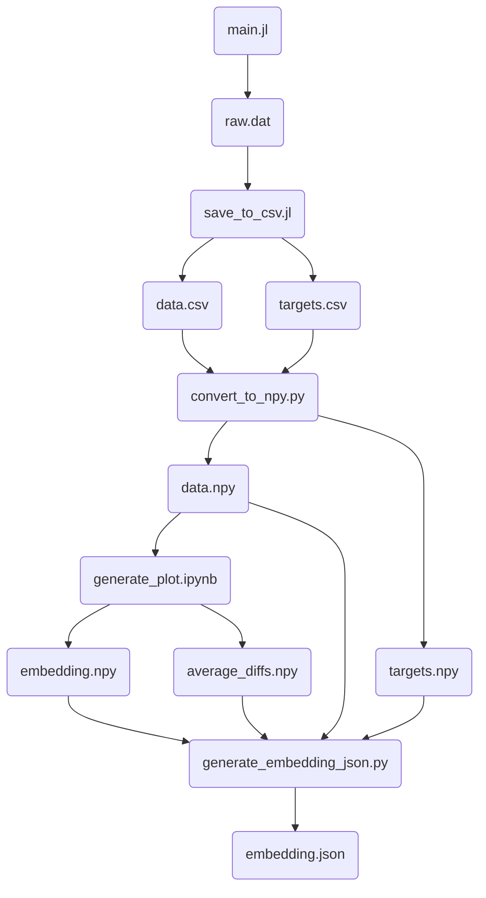

# Cellular Automata Classificiation using UMAP

## About

[Here](https://kylehovey.github.io/blog/automata-nebula) is my original post on the topic. I recently discovered that cellular automata are especially sensitive to initial conditions (which in hindsight should have been obvious). Because of this, classifying all of the Life-Like CA only using a 50% initial random distribution of living/dead cells missed some structure where critical behavior occurred outside of that distribution.

This version of the project runs multiple trials given different stochastic initial conditions, then re-runs UMAP clustering to see what structure emerges. The output of the data pipeline here is a JSON file that can be put into [the explorer](http://kylehovey.github.io/automata-nebula-explorer/index.html) if you clone the project and run it locally.

## Running Project Locally

For generating data or graphics, I use the Julia REPL. `cd` into this project, fire up `julia` then type `]` to get to the package prompt. Type `activate .` to activate the project, then hit backspace to return to the Julia REPL. Open up `main.jl` in your IDE of choice and go to the bottom of the file. I have some example functions down there that I used to generate data and graphics.

Data and graphics will all output in the `generated` directory with unique generated paths that include metadata about what was generated in the path. Maybe in the future all of these functions and metadata could be command line arguments or a TUI, and the output metadata could be YAML. For now, this provides enough utility for me while also allowing me to edit the functionality of the methods easily at the same time.

**Note:** When generating data, make sure to start up Julia with multiple threads as the REPL defaults to only one thread. You can do this with invoking the REPL with the argument `julia --threads=8` (change thread count to whatever works for your system).

For Python requirements, create a `conda` environment using `conda-requirements.txt` with `conda create --name turing-basins --file conda-requirements.txt`. Once that is set up, activate the environment and then run `jupyter notebook` in this project directory. You can open up the notebook then and generate the embedding and scatterplot.

## Data Pipeline

## Ideas
* What would each embedding look like if we used the original technique (constant initial probability) and generated one for each initial value? This might make a cool animation.

## Problems
* Game of Life (b3s23) has similar behavior at many points to another rule (b3s238), but they are pretty far away in this new embedding. Is there some way to make a better embedding where these are closer? Or are we at the limit of this technique?
