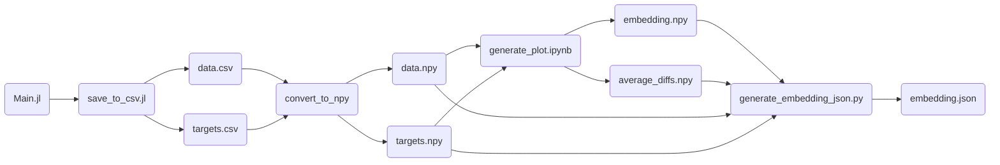

# Cellular Automata Classificiation using UMAP

## Data Pipeline

```mermaid
flowchart LR
  Main(Main.jl)

  SaveToCSV(save_to_csv.jl)
  ConvertToNp(convert_to_npy)
  GenerateEmbedding(generate_plot.ipynb)
  GenerateJson(generate_embedding_json.py)

  DataFileJl(data.csv)
  RulesFileJl(targets.csv)
  
  DataFileNp(data.npy)
  RulesFileNp(targets.npy)
  
  EmbeddingFile(embedding.npy)
  AverageDiffs(average_diffs.npy)
  
  JsonEmbedding(embedding.json)

  Main --> SaveToCSV

  SaveToCSV --> DataFileJl
  SaveToCSV --> RulesFileJl

  DataFileJl --> ConvertToNp
  RulesFileJl --> ConvertToNp

  ConvertToNp --> DataFileNp
  ConvertToNp --> RulesFileNp

  DataFileNp --> GenerateEmbedding
  RulesFileNp --> GenerateEmbedding

  GenerateEmbedding --> EmbeddingFile
  GenerateEmbedding --> AverageDiffs

  EmbeddingFile --> GenerateJson
  AverageDiffs --> GenerateJson
  DataFileNp --> GenerateJson
  RulesFileNp --> GenerateJson

  GenerateJson --> JsonEmbedding
```
